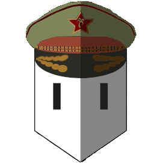

# El-Presidente
___

### By To Nathanaël, Hottot Clément, Abib Paul

##Fais depuis la soutenance :
####-Implementation d'un board pour suivre les différenteq tacheq à faire
####-UI graphique
####-implémentation des tests
####-Sauvegarde et chargement de parties
####-Répartition intéligente des partisans
####-Difficultés de jeu
####-Création d'un super logo!!

## Usage
___

## Architecture Hexagonal
___
